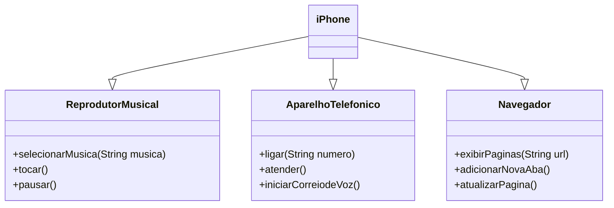

# POO - Desafio UML [DIO](www.dio.me)

## Diagrama UML(Mermaid)

```mermaid
classDiagram
    iPhone -- |> ReprodutorMusical
    iPhone -- |> AparelhoTelefonico
    iPhone -- |> Navegador
    class ReprodutorMusical{
      +selecionarMusica(String musica)
      +tocar()
      +pausar()
    }
    class AparelhoTelefonico{
      +ligar(String numero)
      +atender()
      +iniciarCorreiodeVoz()
    }
    class Navegador{
      +exibirPaginas(String url)
      +adicionarNovaAba()
      +atualizarPagina()
    }
```

## Código Java

Está dentro do pacote iPhoneFun com as funcionalidades requisistadas do iPhone.